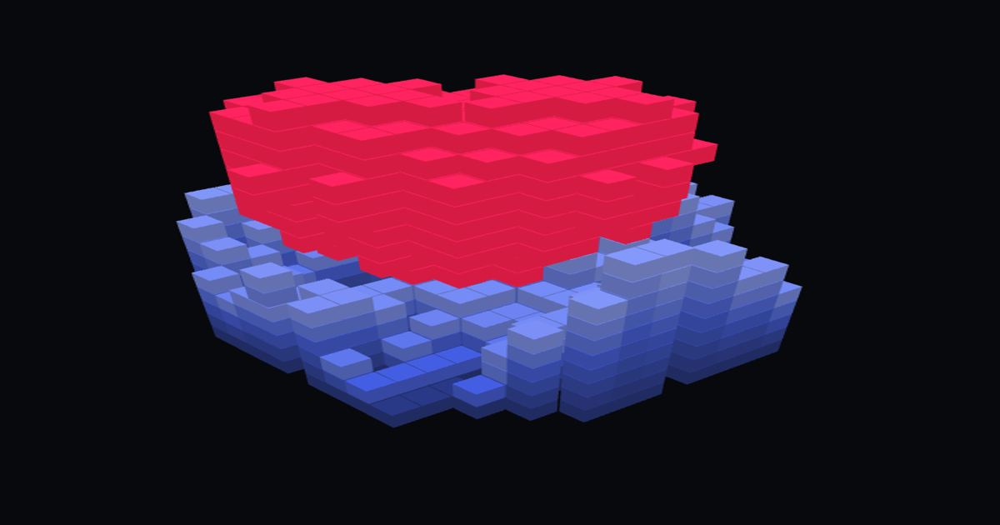

# 🧊 VoxoB (Voxel Generator & Editor)

VoxoB（ボクソブ）は、ブラウザ上で完結する超軽量の3Dボクセルエディタ＆プロシージャルジェネレーターです。
インストールやログインは一切不要。URLを開いたその瞬間から、クリエイティブな作業を開始できます。

**[🌐 VoxoBをブラウザで起動する](https://VoxoB.vercel.app/)**

## ✨ 特徴 (Features)

* **摩擦ゼロのUX (Zero Friction)**
  完全なクライアントサイド・アプリケーション。サーバーへのデータ送信なしで、軽量かつセキュアに動作します。PC・タブレット・スマートフォンに対応。
* **強力なプロシージャル生成 (Procedural Generation)**
  都市、地形、フラクタル、DNA構造などをワンクリックで自動生成。複雑なアルゴリズムをUIベースで直感的に操作できます。
* **アニメーション＆書き出し (Animation & Export)**
  フレーム単位でのボクセルアニメーション作成に対応し、WebMやMP4として直接書き出し可能。
  さらに、3Dモデリングソフトやゲームエンジン用に `OBJ`, `STL`, `GLB` 形式でのエクスポートも標準搭載しています。
* **画像からの3D深度生成 (Depth from Image)**
  インポートした2D画像（PNG/JPG/GIF）の色情報から、自動的に3Dの奥行き（深度）を生成する機能を備えています。

## 🛠 技術スタック (Tech Stack)

* **Graphics:** [Three.js](https://threejs.org/) (WebGL)
* **Core:** Vanilla JavaScript, HTML5, CSS3
* **Architecture:** 極限のポータビリティとデプロイの容易さを追求し、すべてのロジックとUIを単一の `.html` ファイルに集約して設計しています。

## 🚀 使い方 (Usage)

1. [VoxoB](https://VoxoB.vercel.app/) にアクセスします。
2. 左パネルからツール（ペン、ライン、塗りつぶしなど）を選択し、キャンバスに描画します。
3. 右パネルの **ジェネレート** または **アニメジェネレート** から、自動生成アルゴリズムを実行できます。
4. 画像、動画、3Dモデルをインポートし、自動でボクセルに変換します。
5. 完成した作品は、ヘッダー右上の **⬇ エクスポート** ボタンから任意のフォーマットで保存してください。

## 👤 開発者 (Author)

**イケ製作所 (Ike mfr)**
好きなことやってます。

## 📜 ライセンス (License)

This project is open-source and available under the MIT License.
Powered by Three.js (Released under the MIT License by the three.js authors).